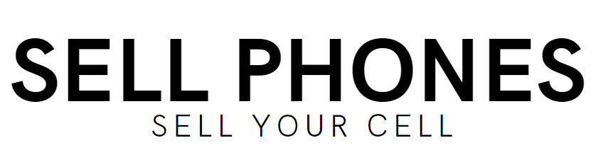
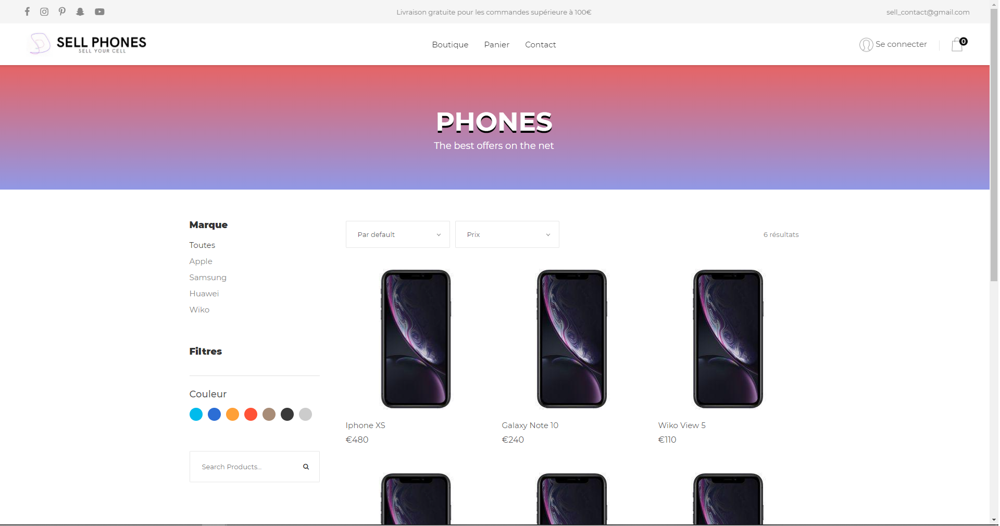
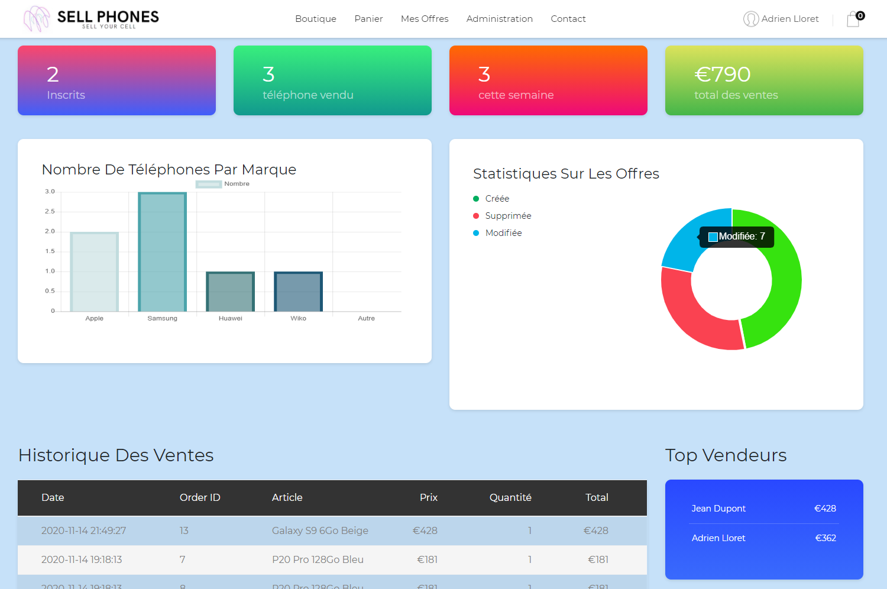
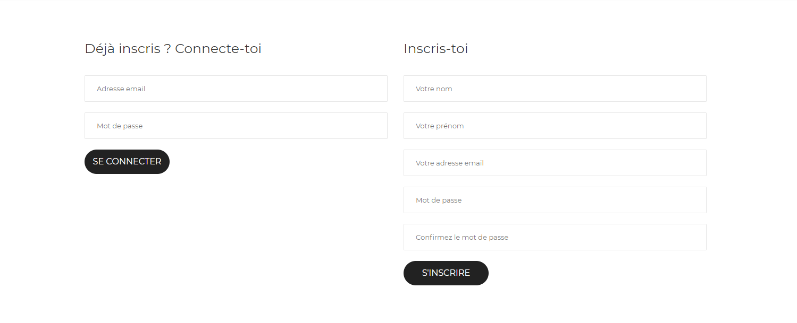
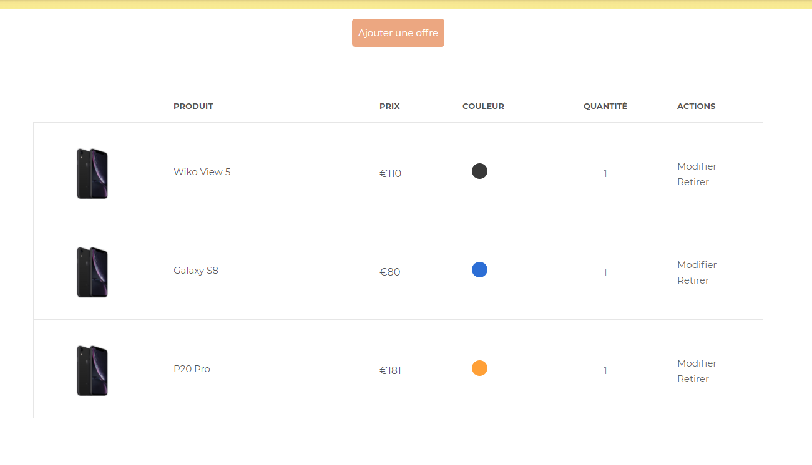
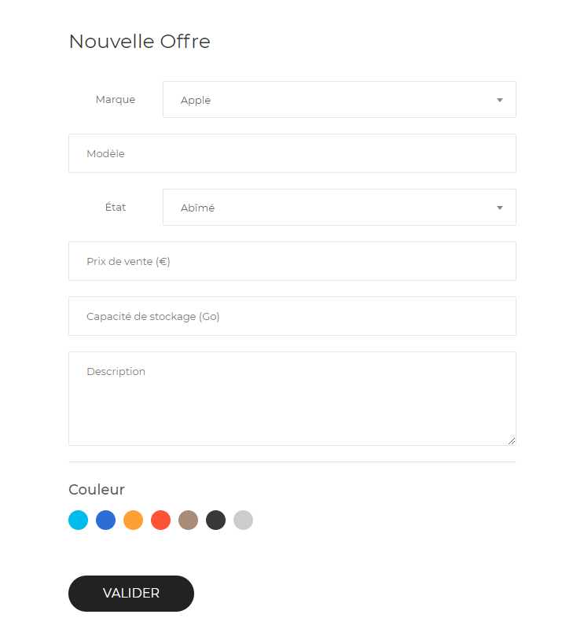

 

# Site e-commerce d'achats/reventes de téléphones mobiles
### Réalisé dans le cadre d'un projet en groupe à l'IUT Montpellier-Sète – Département Informatique
* **Sujet:** https://romainlebreton.github.io/ProgWeb-CoteServeur/projet.html
* **Participants:** [Adrien Lloret](mailto:adrien.lloret@etu.umontpellier.fr), [Karim Derbali](mailto:karim.derbali@etu.umontpellier.fr), [Julien Benincasa](mailto:julien.benincasa@etu.umontpellier.fr) 

## Quelques preview :

  
Accueil

  
  
Le header change en fonction du rôle du client (connecté/visiteur/admin)

  

  
Dashboard Admin

  
  
Top vendeurs : affiche seulement les 10 premiers

  
Historique des ventes : affiche seulement les 10 dernières ventes

  
Connexion/Inscription

  
  
Validation du compte par email

  
Mes offres

  
  
Formulaire pour ajouter/modifier une offre

  

  
Page détails d'un produit

  

